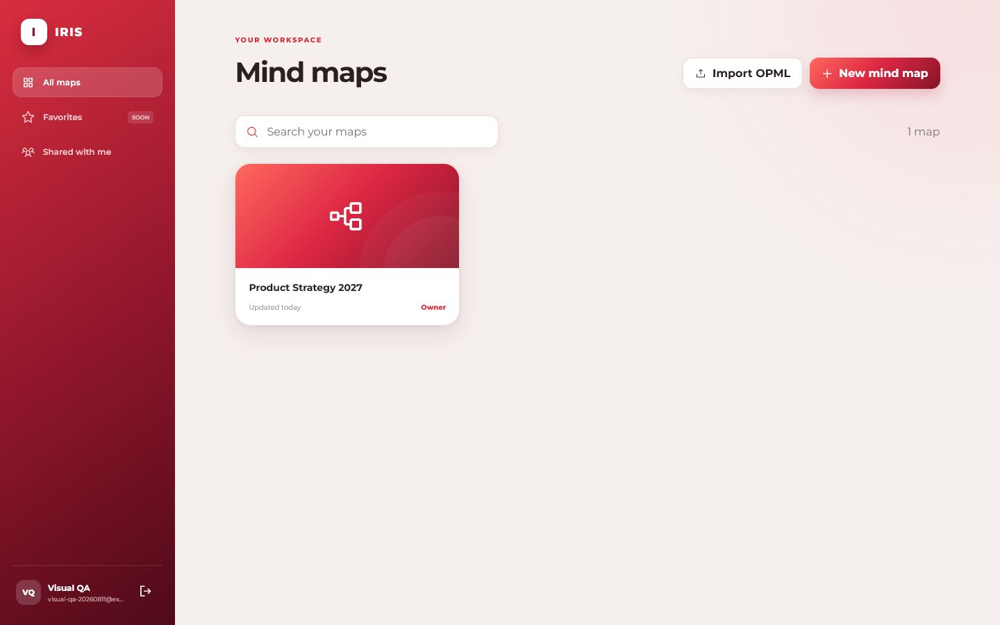
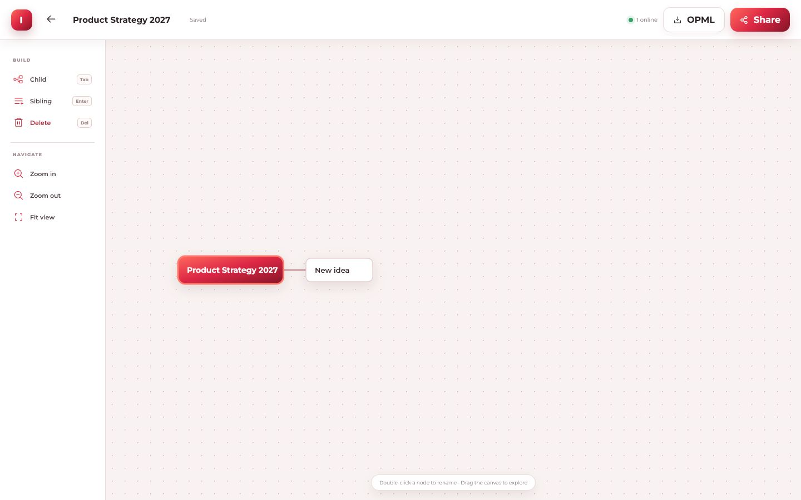

# IRIS prototype

**IRIS** stands for **Integrated Red Ant Colony Information System**. It is a self-hosted, collaborative mind-mapping prototype for internal teams. It provides account authentication, owner/editor/viewer authorization, OPML 2.0 import/export, optimistic concurrency control, revision storage, and live presence/update notifications over WebSockets.





## Run locally

Requires Node.js 22 or newer.

```bash
npm install
npm test
npm run dev
```

Open `http://localhost:3000`. Local data is stored under `data/` and is ignored by Git.

## Permissions

| Role | Read/export | Edit | Invite/remove members | Delete map |
|---|---:|---:|---:|---:|
| Owner | Yes | Yes | Yes | Yes |
| Editor | Yes | Yes | No | No |
| Viewer | Yes | No | No | No |

A map starts private. Its owner may add an existing account as an editor or viewer. Every accepted edit increments the map version and stores a revision. If two sessions save from the same version, the second receives the latest version instead of silently overwriting it.

## Mind-map editor

- Drag a shape from the palette to create a topic, or drag an existing branch to reparent or reorder it.
- Double-click a topic or press `F2` to edit it in place. Topic boxes wrap and resize around multiline text.
- Switch between the visual canvas and the synchronized relationship table. Viewers can navigate and expand branches without exposing edit controls.
- Select multiple topics with `Ctrl/Cmd+Click`, `Shift+Drag`, or Select branch, then apply bulk shape, copy, duplicate, or delete actions.
- Paste an indented outline to create a complete hierarchy in one undoable action; copy, cut, paste, duplicate, promote, and sibling-reorder shortcuts are supported.
- Switch between Pan (`H`) and Select (`V`) canvas tools. In Select mode, dragging across the canvas selects every intersecting topic.
- Use the right Format sidebar to change shape, topic/text colors, text size, emphasis, and alignment. Newly created child topics inherit their parent colors.
- Switch the same hierarchy between Logic Tree, Spider Diagram, Top-down Tree, and Org Chart layouts. Legacy radial maps open automatically as Spider Diagrams.
- Customize map connectors with Smart, Straight, Curved, or Elbow 90-degree paths, optional arrowheads, three thicknesses, and branch-following or custom colors.
- See the current server revision in the workspace as `Map vN`; unsaved local work is marked as a draft until autosave advances the version.
- Use `Tab` for a child, `Enter` for a sibling, arrow keys to navigate, and `Delete` to remove a branch.
- Undo and redo with `Ctrl/Cmd+Z` and `Ctrl/Cmd+Shift+Z`. Fit-map and fit-selection controls keep large maps manageable.

Documents are normalized to schema version 5 with per-topic content, semantic metadata, visual formatting, document layout, and connector settings. Legacy trees and ordinary OPML remain accepted; IRIS writes supported fields as optional OPML outline attributes.

For implementation decisions, verification status, and recommended follow-up work, see [HANDOFF.md](HANDOFF.md).

## Staging deployment on a VPS

This repository does not contain VPS addresses or credentials. Use a non-root deployment user and keep staging separate from production.

1. Build and publish an immutable image tagged with the exact Git commit SHA:

   ```bash
   docker build -t registry.example.invalid/iris:<commit-sha> .
   docker push registry.example.invalid/iris:<commit-sha>
   ```

2. On staging, provide `IRIS_IMAGE`, `SESSION_SECRET`, and optionally `IRIS_PORT`/`ALLOW_REGISTRATION` through a secret manager or protected environment file outside Git. Copy `compose.yaml`, then run:

   ```bash
   docker compose pull
   docker compose up -d
   ./scripts/smoke-test.sh http://127.0.0.1:3000
   ```

3. Put an HTTPS reverse proxy in front of the loopback-only port. Preserve WebSocket upgrade headers for `/live`. Do not expose port 3000 publicly.

4. After the first admin has registered, set `ALLOW_REGISTRATION=false` unless open internal self-registration is intentional.

### Backup and rollback

The named volume holds the SQLite database. Back it up before stateful upgrades using SQLite's online backup mechanism; never copy a live WAL database piecemeal and never commit a backup.

To roll back application code, set `IRIS_IMAGE` to the last healthy immutable image and run `docker compose up -d`, then run the smoke test. This version has no destructive schema migration, so the database remains backward compatible. Record the old/new image digest, time, health-check result, and operator without recording secrets.

## Prototype boundaries

- Live synchronization broadcasts completed saves; it is not character-level CRDT editing.
- Account provisioning is local. SSO/OIDC, password reset, MFA, email invitations, and audit-log export are the next production-hardening steps.
- SQLite is appropriate for a single application instance. Multiple replicas require a shared database plus a WebSocket pub/sub layer.
- Rate limiting should be enforced at the reverse proxy and supplemented in the application before internet exposure.
